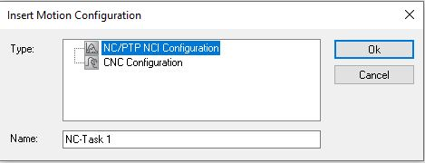
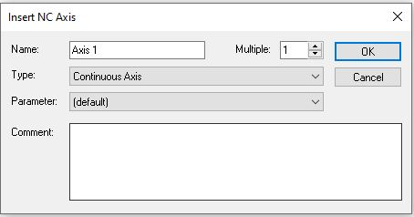

# How to control axis/motor in TwinCAT/Codesys
### Autor: Hristo Ganchev (https://github.com/hganchev)
#### Date: 2024-05-March


## Introduction

TwinCAT is a PLC programming software from Beckhoff. It is based on CODESYS and **IEC 61131-3** standard and it is used to program Beckhoff PLCs. 

>The five programming languages for application programming defined in the IEC 61131-3 are available in the CODESYS development environment.

>* IL (instruction list) is an assembler-like programming language. The IEC 61131-3 user organization PLCopen has declared this language as “deprecated”, which means it shall not be used for new projects anymore.
>* ST (structured text) is similar to programming in Pascal or C
>* LD (ladder diagram) enables programmers to virtually combine relay contacts and coils
>* FBD (function block diagram) enables users to rapidly program both Boolean and analog expressions
>* SFC (sequential function chart) is convenient for programming sequential processes and flows

The logic of the PLC is written in POUs (Program Organization Units). There is several types of POUs, but the most used are:
- Function
- Function Block(FB)
- Program(PRG)

The Function and Function Block POUs are used to write reusable code. The difference between them is that the Function Block can have instance variables it can be represented as a class in C#.

The Program POUs are used to write the logic of the PLC.

Spliting a string in PLC can be a challenging if you don't know what functions to use.There is several ways to do it, but I will show you one of it. 

## What is an axis in TwinCAT
Axis is a part of the MOTION module in TwinCAT. It is used to control the movement of a motor. The axis can be controlled in several ways:
- Position mode
- Velocity mode
- Torque mode

The axis can be connected to a real motor or it can be simulated.

## How to create a simulation axis in TwinCAT
To create a simulation axis in TwinCAT you need to do the following steps:
1. Open the TwinCAT XAE
2. Create a new project
3. Add a new plc project
4. In MOTION section add a new NC configuration

\
5. Add a new axis - Continuous Axis



If the axis is not linked to a real motor, you can use it like a simulation axis.
[More about TwinCAT simulation axis.](https://infosys.beckhoff.com/english.php?content=../content/1033/tf50x0_tc3_nc_ptp/10541544203.html&id=)

## How to control the axis in TwinCAT
To control the axis in TwinCAT you need to use the FBs and FCs from the MOTION section. The most used are:
- **MC_Power** - power on/off the axis
- **MC_Home** - move the axis to the home position
- **MC_Reset** - reset the axis
- **MC_MoveAbsolute** - move the axis to a specific position
- **MC_MoveRelative** - move the axis to a relative position
- **MC_MoveVelocity** - move the axis with a specific velocity
- **MC_Stop** - stop the axis


## [MC_Power](https://infosys.beckhoff.com/english.php?content=../content/1033/tcplclib_tc2_mc2/70049419.html&id=)
The MC_Power function block is used to power on/off the axis. 

Inputs:
```pascal
VAR_INPUT
    Enable          : BOOL; (* B *)
    Enable_Positive : BOOL; (* E *)
    Enable_Negative : BOOL; (* E *)
    Override        : LREAL (* V *) := 100.0; (* in percent - Beckhoff proprietary input *)
    BufferMode      : MC_BufferMode; (* V *)
    Options         : ST_PowerOptions;
END_VAR
```
Outputs:
```pascal
VAR_OUTPUT
    Status  : BOOL; (* B *)
    Busy    : BOOL; (* V *)
    Active  : BOOL; (* V *)
    Error   : BOOL; (* B *)
    ErrorID : UDINT; (* E *)
END_VAR
```
Enable, Enable_Positive and Enable_Negative are used to power on/off the axis. The Enable input is used to power on/off the axis. The Enable_Positive and Enable_Negative are used to power on/off the positive and negative power stage of the axis.

Status is used to show the status of the axis. If the axis is powered on, the Status is **TRUE**. If the axis is powered off, the Status is **FALSE**.


## [MC_Home](https://infosys.beckhoff.com/english.php?content=../content/1033/tcplclib_tc2_mc2/70049419.html&id=)
The MC_Home function block is used to move the axis to the home position.

Inputs
```pascal
VAR_INPUT
    Execute        : BOOL; 
    Position        : LREAL         := DEFAULT_HOME_POSITION;
    HomingMode     : MC_HomingMode;
    BufferMode     : MC_BufferMode; 
    Options        : ST_HomingOptions;
    bCalibrationCam    : BOOL; 
END_VAR
```

Outputs
```pascal
VAR_OUTPUT
    Done     : BOOL;
    Busy     : BOOL;
    Active     : BOOL;
    CommandAborted : BOOL;
    Error     : BOOL;
    ErrorID         : UDINT;
END_VAR
```

When Execute is **TRUE** the axis will start moving to the home position. The home position is set in the Position input. 

HomingMode determines in which way the calibration is carried out.

>- **MC_DefaultHoming** - Initiates standard homing.
>- **MC_Direct** - Sets the axis position directly to Position without executing a movement.
>- **MC_ForceCalibration** - Enforces the "axis is calibrated" state. No movement takes place, > and the position remains unchanged.
>- **MC_ResetCalibration** - Resets the calibration state of the axis. No movement takes place, and the position remains unchanged.

When the axis is moving to the home position, the Busy is **TRUE**. When the axis is at the home position, the Done is **TRUE**.

## [MC_Reset](https://infosys.beckhoff.com/english.php?content=../content/1033/tcplclib_tc2_mc2/70050955.html&id=)

The MC_Reset function block is used to reset the axis.

Inputs
```pascal
VAR_INPUT
    Execute : BOOL;
END_VAR
```

Outputs
```pascal
VAR_OUTPUT
    Done    : BOOL;
    Busy    : BOOL;
    Error   : BOOL;
    ErrorID : UDINT;
END_VAR
```

When Execute is **TRUE** the axis will start resetting. When the axis is resetting, the Busy is **TRUE**. When the axis is reset, the Done is **TRUE**.

## [MC_MoveAbsolute](https://infosys.beckhoff.com/english.php?content=../content/1033/tcplclib_tc2_mc2/70049419.html&id=)

The MC_MoveAbsolute function block is used to move the axis to a specific position.

Inputs
```pascal
VAR_INPUT
    Execute      : BOOL;
    Position     : LREAL; 
    Velocity     : LREAL; 
    Acceleration : LREAL; 
    Deceleration : LREAL; 
    Jerk         : LREAL;
    BufferMode   : MC_BufferMode;
    Options      : ST_MoveOptions;
END_VAR
```

Outputs
```pascal
VAR_OUTPUT
    Done           : BOOL;
    Busy           : BOOL;
    Active         : BOOL;
    CommandAborted : BOOL;
    Error          : BOOL;
    ErrorID        : UDINT;
END_VAR
```

When Execute is **TRUE** the axis will start moving to the position set in the Position input. The velocity, acceleration, deceleration and jerk are set in the Velocity, Acceleration, Deceleration and Jerk inputs.

When the axis is moving to the position, the Busy is **TRUE**. When the axis is at the position, the Done is **TRUE**.

## [MC_MoveRelative](https://infosys.beckhoff.com/english.php?content=../content/1033/tcplclib_tc2_mc2/70096267.html&id=)

The MC_MoveRelative function block is used to move the axis to a relative position.

Inputs
```pascal
VAR_INPUT
    Execute      : BOOL;
    Distance     : LREAL;
    Velocity     : LREAL;
    Acceleration : LREAL;
    Deceleration : LREAL;
    Jerk         : LREAL;
    BufferMode   : MC_BufferMode;
    Options      : ST_MoveOptions;
END_VAR
```

Outputs
```pascal
VAR_OUTPUT
    Done           : BOOL;
    Busy           : BOOL;
    Active         : BOOL;
    CommandAborted : BOOL;
    Error          : BOOL;
    ErrorID        : UDINT;
END_VAR
```

When Execute is **TRUE** the axis will start moving to the relative position set in the Distance input. The velocity, acceleration, deceleration and jerk are set in the Velocity, Acceleration, Deceleration and Jerk inputs.

When the axis is moving to the relative position, the Busy is **TRUE**. When the axis is at the relative position, the Done is **TRUE**.

## [MC_MoveVelocity](https://infosys.beckhoff.com/english.php?content=../content/1033/tcplclib_tc2_mc2/70102411.html&id=)

The MC_MoveVelocity function block is used to move the axis with a specific velocity.

Inputs
```pascal
VAR_INPUT
    Execute      : BOOL; (* B *)
    Velocity     : LREAL; (* E *)
    Acceleration : LREAL; (* E *)
    Deceleration : LREAL; (* E *)
    Jerk         : LREAL; (* E *)
    Direction    : MC_Direction := MC_Positive_Direction; (* E *)
    BufferMode   : MC_BufferMode; (* E *)
    Options      : ST_MoveOptions; (* V *)
END_VAR
```

Outputs
```pascal
VAR_OUTPUT
    InVelocity     : BOOL; (* B *)
    Busy           : BOOL; (* E *)
    Active         : BOOL; (* E *)
    CommandAborted : BOOL; (* E *)
    Error          : BOOL; (* B *)
    ErrorID        : UDINT; (* E *)
END_VAR
```

When Execute is **TRUE** the axis will start moving with the velocity set in the Velocity input. The acceleration, deceleration and jerk are set in the Acceleration, Deceleration and Jerk inputs.

When the axis is moving with the velocity, the Busy is **TRUE**. After the axis acceleration, the InVelocity output assumes the value **TRUE** once the requested target velocity has been reached. The InVelocity output remains **TRUE** until the axis velocity is changed by another command. As soon as a velocity deviation is determined, the output signals **FALSE**. When the axis is stopped, the InVelocity is **FALSE**.

## [MC_Stop](https://infosys.beckhoff.com/english.php?content=../content/1033/tcplclib_tc2_mc2/70049419.html&id=)

The MC_Stop function block is used to stop the axis.

Inputs
```pascal
VAR_INPUT
    Execute      : BOOL; 
    Deceleration : LREAL; 
    Jerk         : LREAL;
    Options      : ST_MoveOptions; 
END_VAR
```

Outputs
```pascal
VAR_OUTPUT
    Done           : BOOL;
    Busy           : BOOL;
    Active         : BOOL;
    CommandAborted : BOOL;
    Error          : BOOL;
    ErrorID        : UDINT;
END_VAR
```

When Execute is **TRUE** the axis will start stopping. The deceleration and jerk are set in the Deceleration and Jerk inputs.

When the axis is stopping, the Busy is **TRUE**. When the axis is stopped, the Done is **TRUE**.

## Example of logic to control the axis
```pascal
FUNCTION_BLOCK MC_AxisControl

VAR_INPUT	
END_VAR
VAR_IN_OUT
	axisRef			: AXIS_REF;
END_VAR
VAR_OUTPUT
END_VAR
VAR
	// Controls
	bEnable				: BOOL;
	bHome				: BOOL;
	bReset				: BOOL;
	bMove				: BOOL;
	bStop				: BOOL;
	                	
	// Statuses     	
	bEnabled			: BOOL;
	bReferenced			: BOOL;
	bError				: BOOL;
	nErrorID			: UDINT;
	bMoving				: BOOL;
	bInPosition			: BOOL;
	nActualPosition		: LREAL;
	nActualVelocity		: LREAL;
	
	// Settings
	nTargetPosition		: LREAL;
	nTargetVelocity		: LREAL;
	nTargetAcceleration	: LREAL;
	stHomingOptions		: ST_HomingOptions;
	
	fbEnable			: MC_Power;
	fbHome				: MC_Home;
	fbMove				: MC_MoveAbsolute;
	fbReset				: MC_Reset;
	fbActualPosition	: MC_ReadActualPosition;
	fbActualVelocity	: MC_ReadActualVelocity;
END_VAR
```
Where **axisRef** is the reference to the axis.

```pascal
// Power On - power on/off the axis
fbEnable(
	Axis:= axisRef, 
	Enable:= bEnable, 
	Enable_Positive:= bEnable, 
	Enable_Negative:= bEnable, 
	Override:= , 
	BufferMode:= , 
	Options:= , 
	Status=> bEnabled, 
	Busy=> , 
	Active=> , 
	Error=> , 
	ErrorID=> );
	
// Home - Reference the axis
stHomingOptions.ReferenceMode := E_EncoderReferenceMode.ENCODERREFERENCEMODE_DEFAULT;
stHomingOptions.SearchDirection := MC_Direction.MC_Negative_Direction;
stHomingOptions.SearchVelocity := 10;
fbHome(
	Axis:= axisRef, 
	Execute:= bHome AND bEnabled, 
	Position:= 0, 
	HomingMode:= MC_HomingMode.MC_DefaultHoming, 
	BufferMode:= , 
	Options:= stHomingOptions, 
	bCalibrationCam:= , 
	Done=> , 
	Busy=> , 
	Active=> , 
	CommandAborted=> , 
	Error=> , 
	ErrorID=> );
	
// Reset - reset error of axis
fbReset(
	Axis:= axisRef, 
	Execute:= bReset, 
	Done=> , 
	Busy=> , 
	Error=> , 
	ErrorID=> );
	
// Move Absolute - move to absolute position
fbMove(
	Axis:= axisRef, 
	Execute:= bMove AND bEnabled, 
	Position:= nTargetPosition, 
	Velocity:= nTargetVelocity, 
	Acceleration:= nTargetAcceleration, 
	Deceleration:= nTargetAcceleration, 
	Jerk:= , 
	BufferMode:= , 
	Options:= , 
	Done=> , 
	Busy=> , 
	Active=> , 
	CommandAborted=> , 
	Error=> , 
	ErrorID=> );
	
// Status Actual Position
fbActualPosition(
	Axis:= axisRef, 
	Enable:= TRUE, 
	Valid=> , 
	Busy=> , 
	Error=> , 
	ErrorID=> , 
	Position=> nActualPosition);

// Status Actual Velocity	
fbActualVelocity(
	Axis:= axisRef, 
	Enable:= TRUE, 
	Valid=> , 
	Busy=> , 
	Error=> , 
	ErrorID=> , 
	ActualVelocity=> nActualVelocity);
	
// Statuses
axisRef.ReadStatus();
bReferenced := axisRef.Status.Homed;
bMoving := axisRef.Status.Moving;
bInPosition := axisRef.Status.InTargetPosition AND ABS(nTargetPosition - nActualPosition) < 0.1;
bError := axisRef.Status.Error;
nErrorID := axisRef.Status.ErrorID;

// Reset Move
IF bInPosition AND NOT bMoving THEN
	bMove := FALSE;
END_IF
	
```

## Example of the usage can be find in the following link:
[twincat-tools](https://github.com/hganchev/twincat-tools/tree/main/TwinCAT%20Tools/twincat-tools/POUs/AxisControl) library.

